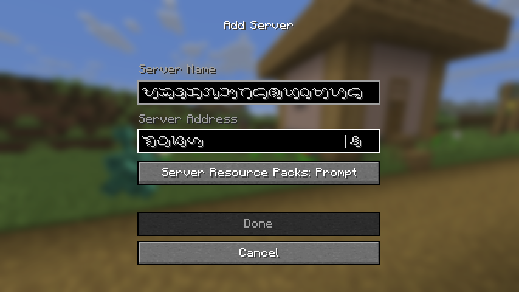

# Glomphosche

A mod that *'hacks'* in composed glyphs since `char`s weren't enough.

## Alpha Usage

This mod is currently in Alpha testing. The composition system is already
working, though needing polishing and possibly improved capabilities that can be
built on top with.

Currently, supports the Baybayin script, or the characters in the Tagalog
Unicode block, specifically vowel markers above and below the consonants as well
as the vowel cancellers; treat letter + markers as one glyph. This also replaces
the character textures to this mod's custom ones.

Since `0.2.0`, support for composing modern Hangul Jamo into Hangul syllables.
This only supports modern jamo and follows the composition calculation to map
proper jamo sequences to pre-composed Unicode characters. 

## Technicals

The internals are still being polished. You can check the first few lines of
the `GlomphoscheImpl` class and even the mentioned `Node` classes there that you
may find of interest.

```java
import io.github.startsmercury.glomphosche.impl.client.GlomphoscheImpl;
import io.github.startsmercury.glomphosche.impl.client.node.DiscreteNode;
import io.github.startsmercury.glomphosche.impl.client.node.hangul_jamo.composable.ComposableHangulJamoNode;
import net.minecraft.network.chat.FontDescription;

class Example
{

void initialize()
{
// register modern Hangul Jamo handler, or your own handler
// for a different use, if you implemented one
GlomphoscheImpl.ROOT
    .inner()
    .add(new ComposableHangulJamoNode());

// the letter 'f'
DiscreteNode node1 = GlomphoscheImpl.LOOKUP
    .computeDiscreteIfAbsent('f')
    .first();
// the theoretical glyph 'fi'
DiscreteNode node2 = node1
    .computeDiscreteIfAbsent('i')
    .first();
// register the font that retextures 'f' as the glyph representing 'fi'
node2.fontOverride(FontDescription.DEFAULT); // replace with your own

// This one is for 'ffi' by retexturing 'f'
GlomphoscheImpl.ROOT
    .computeDiscreteIfAbsent('f').first()
    .computeDiscreteIfAbsent('f').first()
    .computeDiscreteIfAbsent('i').first()
    // replace with your own
    .fontOverride(FontDescription.DEFAULT);
}

}
```

The shortest path to test with an editable text box is through the *Add Server*
screen found in `Title Screen > Multiplayer > Add Server`.


