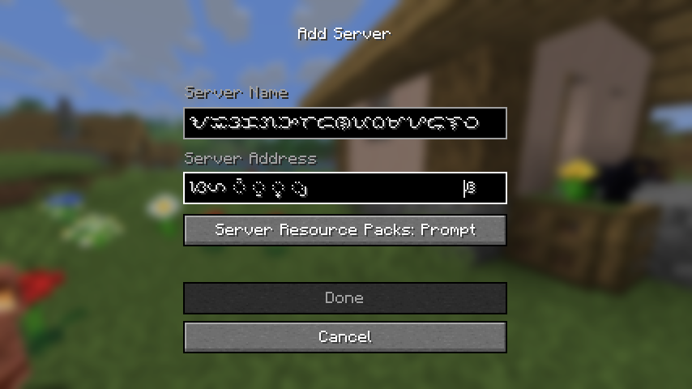
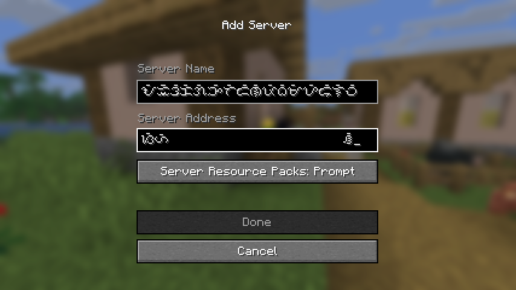
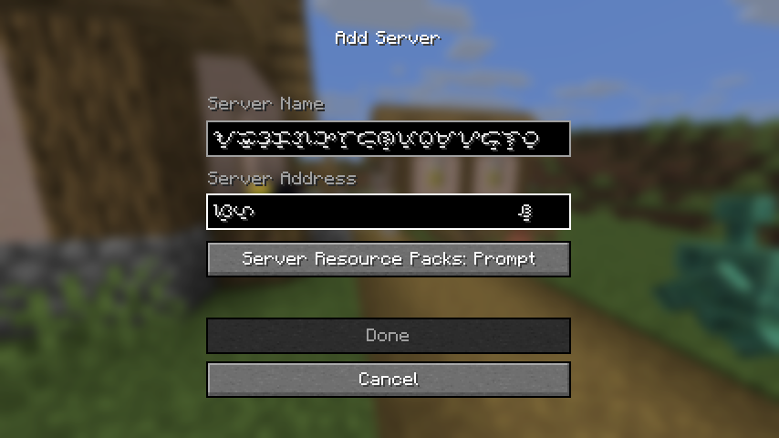
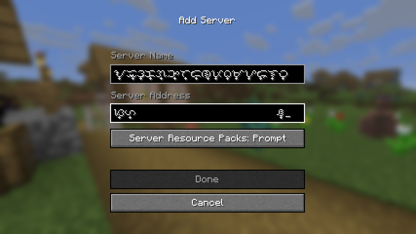

# Glomphosche

A mod that *'hacks'* in composed glyphs since `char`s weren't enough.

## Alpha Usage

This mod is currently in Alpha testing. The vital feature is realized, that is
a system that could somehow combine characters or codepoints into a singular
glyph.

Currently, only Baybayin, also known as the Tagalog script in Unicode, is
pre-included and there currently is no convenient way to register additional
sequences aside from creating a helper mod. You also need to somehow have the
capability to enter Tagalog/Baybayin characters, either using a keyboard mapper
or simply find one that can convert Latin strings into Tagalog/Baybayin.

You may register the first level characters with Minecraft's default font or
your own if it'll work better for what you are achieving. Do note that you want
to retexture the <u>first</u> character and likely use separate textures. You
are required to already know how to manage fonts through vanilla Minecraft\
resource packs.

```java
// the letter 'f'
var node1 = GlomphoscheImpl.ROOT.getOrCreate('f');
// the theoretical glyph 'fi'
var node2 = node1.getOrCreate('i');
// register the font that retextures 'f' as the glyph representing 'fi'
node2.register(/* FontDescription.Source here */);

// This one is for 'ffi' by retexturing 'f'
GlomphoscheImpl.ROOT
    .getOrCreate('f')
    .getOrCreate('f')
    .getOrCreate('i')
    .register(/* FontDescription.Source here */);
```

The shortest path to test with an editable text box is through the *Add Server*
screen found in `Title Screen > Multiplayer > Add Server`.






